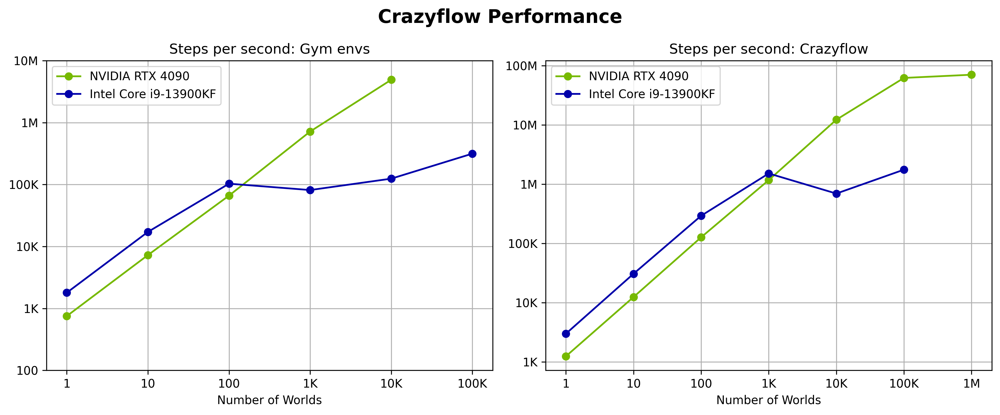

--------------------------------------------------------------------------------

Fast, parallelizable simulations of Crazyflies with JAX.

[![Python Version]][Python Version URL] [![Ruff Check]][Ruff Check URL] [![Documentation Status]][Documentation Status URL] [![Tests]][Tests URL]

[Python Version]: https://img.shields.io/badge/python-3.10+-blue.svg
[Python Version URL]: https://www.python.org

[Ruff Check]: https://github.com/utiasDSL/crazyflow/actions/workflows/ruff.yml/badge.svg?style=flat-square
[Ruff Check URL]: https://github.com/utiasDSL/crazyflow/actions/workflows/ruff.yml

[Documentation Status]: https://readthedocs.org/projects/crazyflow/badge/?version=latest
[Documentation Status URL]: https://crazyflow.readthedocs.io/en/latest/?badge=latest

[Tests]: https://github.com/utiasDSL/crazyflow/actions/workflows/testing.yml/badge.svg
[Tests URL]: https://github.com/utiasDSL/crazyflow/actions/workflows/testing.yml


## Architecture

Crazyflow is a high-performance simulation framework for Crazyflie drones that leverages JAX for efficient parallelization and automatic differentiation. The architecture is designed around a flexible pipeline that can be configured at initialization time, enabling users to swap out physics backends, control methods, and integration schemes.

### Core Components

#### Simulation Pipeline
The simulation is built as a pipeline of functions that are composed at initialization time based on the configuration. This approach avoids runtime branching and allows JAX to optimize the entire pipeline as a single computation. Users can insert their own pure functions into the pipeline to modify the simulation behavior while maintaining compatibility with JAX's optimizations.

#### Physics Backends
Multiple physics models are supported:
- analytical: A first-principles model based on physical equations
- sys_id: A system-identified model trained on real drone data

#### Control Modes
Different control interfaces are available:
- state: High-level control of position, velocity, and yaw
- attitude: Mid-level control of collective thrust and orientation
- thrust: Low-level control of individual motor thrusts

#### Integration Methods
We support multiple integration schemes for additional precision:
- euler: Simple first-order integration
- rk4: Fourth-order Runge-Kutta integration for higher accuracy
- symplectic\_euler: Symplectic integration for conservation of energy

### Parallelization
Crazyflow supports massive parallelization across:
- Worlds: Independent simulation environments that can run in parallel
- Drones: Multiple drones within each world
- Devices: Computations can be executed on CPU or GPU
This parallelization is achieved through JAX's vectorization capabilities, allowing thousands of simulations to run simultaneously with minimal overhead.

### Domain Randomization
The framework supports domain randomization through the crazyflow/randomize module, allowing parameters like mass to be varied across simulations to improve sim-to-real transfer.

### Functional Design
The simulation follows a functional programming paradigm: All state is contained in immutable data structures. Updates create new states rather than modifying existing ones. All functions are pure, enabling JAX's transformations (JIT, grad, vmap) and thus automatic differentiation through the entire simulation, making it suitable for gradient-based optimization and reinforcement learning.

### Contacts and Non-Drone Models
We focus on drones dynamics in free-space flight. Consequently, no models other than drones are available in the simulation and contact dynamics with external objects are not considered. However, we use MuJoCo for contact detection and visualization. Users can load their own objects into the simulation by changing the MuJoCo world spec. Drone collisions with these objects will be detected during collision checks, but they won't have an effect on the dynamics (i.e. drones will pass through objects). Similarly, the objects themselves will be static.

### Visualization
We use `gymnasium`'s MuJoCo renderer and synchronize the simulation data with MuJoCo to either render an interactive UI or RGB arrays.

## Examples
The repository includes several example scripts demonstrating different capabilities:
| Example                                   | Description                                                 |
| ----------------------------------------- | ----------------------------------------------------------- |
| [`hover.py`](examples/hover.py)           | Basic hovering using state control                          |
| [`thrust.py`](examples/thrust.py)         | Direct motor control using thrust commands                  |
| [`render.py`](examples/render.py)         | Visualization of multiple drones with motion traces         |
| [`contacts.py`](examples/contacts.py)     | Collision detection between drones                          |
| [`gradient.py`](examples/gradient.py)     | Computing gradients through the simulation for optimization |
| [`change_pos.py`](examples/change_pos.py) | Manipulating drone positions programmatically               |

## Performance
These benchmarks give you a rough idea of the performance you should expect from the simulator. Gym benchmarks use gym environments with a step frequency of 50Hz while simulating at 500Hz. The simulation benchmarks use 500Hz.



The chart above shows the performance of Crazyflow on different hardware. The simulator can achieve close to 100 million steps per second on a GPU with 1 million parallel environments. The gym environment, which includes additional overhead for the Gymnasium interface and is not fully optimized, still achieves decent performance with over 98,000 steps per second on GPU with 10,000 parallel environments.

Performance benchmarks were run on:
- CPU: Intel Core i9-13900KF
- GPU: NVIDIA RTX 4090

To reproduce the benchmark results, rerun the `benchmark/main.py` script.

## Known Issues
- `"RuntimeError: MUJOCO_PATH environment variable is not set"` upon installing this package. This error can be resolved by using `venv` instead of `conda`. Somtimes the `mujoco` install can [fail with `conda`](https://github.com/google-deepmind/mujoco/issues/1004).
- If using `zsh` don't forget to escape brackets when installing additional dependencies: `pip install .\[gpu\]`.

### Using the project with VSCode devcontainers

**Running on CPU**: by default the containers run on CPU. You don't need to take any action.

**Running on GPU**: The devcontsainers can easily run using your computer's NVIDIA GPU on Linux and Windows. This makes sense if you want to accelerate simulation by running thousands of simulation in parallel. In order to work you need to install the [CUDA Toolkit](https://developer.nvidia.com/cuda-downloads?target_os=Linux&target_arch=x86_64&Distribution=WSL-Ubuntu&target_version=2.0&target_type=deb_local), [NVIDIA Container runtime](https://developer.nvidia.com/container-runtime) for your computer. Finally, enable GPU access to the devcontainers by setting the commented out `"--gpus=all"` and `"--runtime=nvidia"` flags in `devcontainer.json`. 


**Linux**
1. Make sure to be in a X11 session ([link](https://askubuntu.com/questions/1410256/how-do-i-use-the-x-window-manager-instead-of-wayland-on-ubuntu-22-04)), otherwise rendering of the drone will fail.
2. Install [Docker](https://docs.docker.com/engine/install/) (, and make sure Docker Daemon is running)
3. Install [VSCode](https://code.visualstudio.com/), with [devcontainer extension](https://marketplace.visualstudio.com/items?itemName=ms-vscode-remote.remote-containers), and [remote dev pack](https://marketplace.visualstudio.com/items?itemName=ms-azuretools.vscode-docker).
4. Clone this project's code. Rename `/.devcontainer/devcontainer.linux.json` to `/.devcontainer/devcontainer.json`.
5. Open this project in VSCode. VSCode should automatically detect the devcontainer and prompt you to `Reopen in container`. If not, see [here](https://code.visualstudio.com/docs/devcontainers/containers#_quick-start-open-an-existing-folder-in-a-container) to open manually. Note: Opening the container for the first time might take a while (up to 15 min), as the container is pulled from the web and build.

**Windows** (requires Windows 10 or later)

For windows, we require WSL2 to run the devcontainer. (So its actually Linux with extra steps.) Full instructions can be found [in the official docs](https://code.visualstudio.com/blogs/2020/07/01/containers-wsl#_getting-started). Here are the important steps:
1. Install [Docker](https://docs.docker.com/desktop/setup/install/windows-install/), and WSL2, and Ubuntu 22.04 LTS (, and make sure Docker Daemon is running)
2. Docker will recognize that you have WSL installed and prompt you via Windows Notifications to enable WSL integration -> confirm this with `Enable WSL integration`. If not, open `Docker Desktop`, navigate to the settings, and manually enable WSL integration. (There are TWO setting options for this. Make sure to enable BOTH!)
3. Install [VSCode](https://code.visualstudio.com/), with the [WSL extension](https://marketplace.visualstudio.com/items?itemName=ms-vscode-remote.remote-wsl), [devcontainer extension](https://marketplace.visualstudio.com/items?itemName=ms-vscode-remote.remote-containers), and [remote dev pack](https://marketplace.visualstudio.com/items?itemName=ms-azuretools.vscode-docker).
4. Clone the source code for the exercises in the WSL2 file system to `/home` (`~`), or wherever you like. (Performance when working on the WSL file system is much better compared to Windows file system). You can access the WSL filesystem either by starting a WSL/Ubuntu console, or via the Windows File Explorer at `\\wsl.localhost\Ubuntu\home` (replace `Ubuntu` with your distro, if necessary).
7. Rename `/.devcontainer/devcontainer.windows.json` to `/.devcontainer/devcontainer.json`.
8. Open this project in VSCode. The easiest way to do so is by starting a WSL/Ubuntu shell, navigating via `cd` to the source code, then type `code .` to open VSCode. VSCode should automatically detect the devcontainer and prompt you to `Reopen in container`. If not, see [here](https://code.visualstudio.com/docs/devcontainers/containers#_quick-start-open-an-existing-folder-in-a-container) to open manually. Note: Opening the container for the first time might take a while (up to 15 min), as the container is pulled from the web and build.


**MacOS**

Unfortunately, we did not get the devcontainer to work with MacOS yet, even after following [those](https://gist.github.com/sorny/969fe55d85c9b0035b0109a31cbcb088) steps. We expect that the issue is related to Mujoco rendering from inside the Docker container and display forwarding with X11. There is also an [unresolved Issue](https://github.com/google-deepmind/mujoco/issues/1047) on GitHub. If you manage to make it work, please let us know.

Until then, MacOS users are required to install this project using an python environment manager such as [conda](https://docs.anaconda.com/anaconda/install/) or [mamba](https://mamba.readthedocs.io/en/latest/). If you use conda, these are the required commands: ```conda create --name crazyflow -c conda-forge python=3.11```, ```conda activate crazyflow```, ```conda install pip```, ```pip install -e .```.

____________

Known Issues:
   - if building docker container fails at `RUN apt-get update`, make sure your host systems time is set correct: https://askubuntu.com/questions/1511514/docker-build-fails-at-run-apt-update-error-failed-to-solve-process-bin-sh

