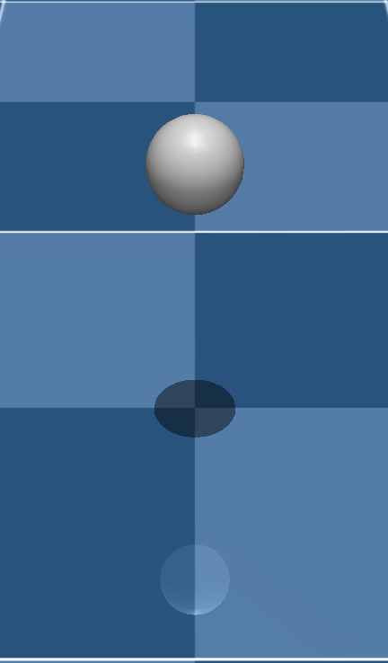
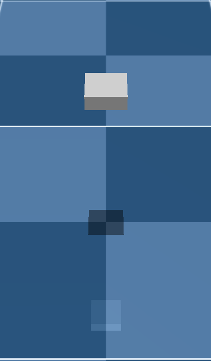

# Examples

Selected example scripts. Check out more in `examples/`

---

### State control

A minimal demo showing how to use the Sim API at a very high level: create a Sim, send simple position commands and step the simulation. Useful to get started with high-level position/setpoint control.

```bash
python examples/change_pos.py
```

---

### Cameras & RGBD

Shows how to obtain RGB and depth frames from the renderer. Demonstrates offscreen capture via sim.render(), retrieving image arrays for perception or visual‑in‑the‑loop controllers, and saving sequences (GIFs).

```bash
python examples/cameras.py
```


---

### Contacts & collision model

Demonstrates how to query contact information from the simulation and how to switch collision geometry types (e.g., sphere → box) for higher‑fidelity contact modeling. Useful for debugging collisions or when more accurate contact checks are required.

```bash
python examples/contacts.py
```

{width=200 height=200}
{width=200 height=200}

---

### LED deck & materials

Illustrates how to activate and control the LED deck and other drone material colors at runtime for visualization and debugging.

```bash
python examples/led_deck.py
```


---

### Randomization

Shows how to add reset‑time randomization: initial position/quaternion randomization, mass/inertia perturbations and other properties that should vary between episodes. The example demonstrates how to register reset randomizers and how to persist different initial conditions across runs.

Run:
```bash
python examples/randomize.py
```

---

### Disturbance

Demonstrates step‑time disturbances inserted into the step pipeline (external forces/torques, actuator noise, etc.). The example (examples/disturbance.py) shows how to insert a disturbance function into sim.step_pipeline, compare disturbed vs undisturbed runs and optionally plot the resulting trajectories.

Run:
```bash
python examples/disturbance.py
```

---

### Figure‑8 / RL environment

A scripted figure‑8 environment intended for evaluation or as a training target. The example shows how to create vectorized envs, apply the NormalizeActions wrapper and step/render the environment. It does not include any agent implementations — integrate the environment with your preferred RL training code (Stable Baselines3, RLlib, custom JAX trainers, etc.).

Run:
```bash
python examples/figure8.py
```


---

For API details and configuration options referenced by these examples, see the [API Reference](api/index.md) and [Usage](usage.md).