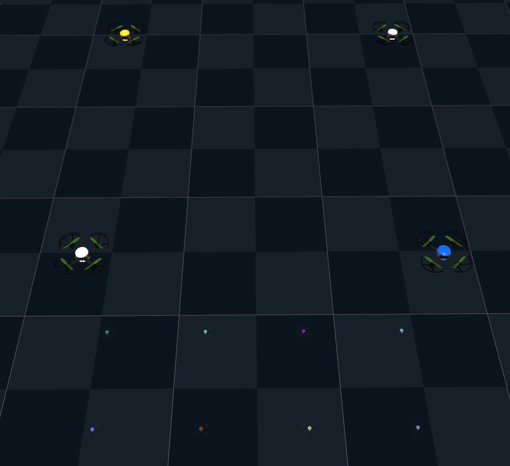
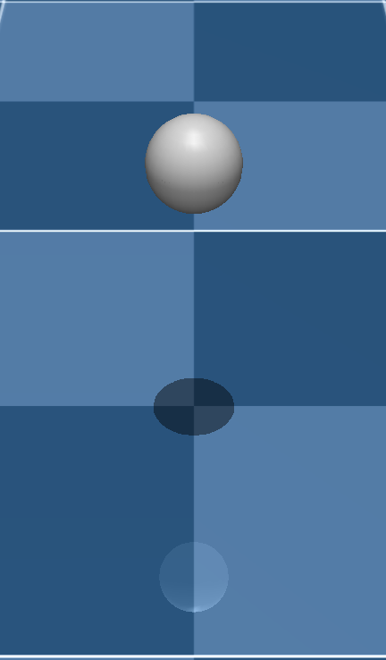
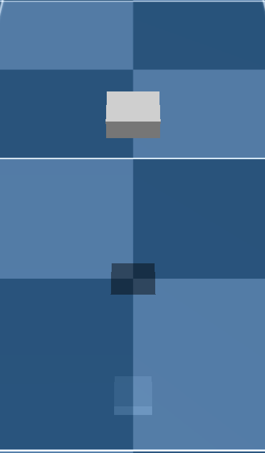

# Examples

These runnable examples cover control, JAX transformations, pipeline extensions, rendering, contacts, and Gymnasium environments. Start with hover if you're new, or jump to the section that matches your use case.

---

## Hover

A single drone commanded to hold a fixed height using state control. This is the minimal end-to-end loop: create a `Sim`, reset it, apply a state command, and step forward.

<!-- notest: imported script, covered by tests/integration/test_examples.py -->
```{ .python notest }
--8<-- "examples/control/hover.py"
```

```bash
python examples/control/hover.py
```

---

## Attitude control

Commanding roll, pitch, yaw, and collective thrust directly. This level bypasses the Mellinger position loop and is typical for RL agents that output attitude targets.

<!-- notest: imported script, covered by tests/integration/test_examples.py -->
```{ .python notest }
--8<-- "examples/control/attitude.py"
```

---

## Sampling-based MPC

A sampling-based model predictive controller tracks a Lissajous curve while avoiding a grid of obstacles. It rolls out thousands of candidate control sequences in parallel using identified dynamics, then applies the first action from a cost-weighted update of the best samples. The controller automatically uses a GPU when one is available and lowers the sample count on CPU.

```bash
python examples/control/sampling.py
```

---

## Gradient descent through dynamics

Because the simulator is built entirely from JAX operations, `jax.grad` can differentiate through it. Starting the drone above the target height keeps it away from the floor, so the floor-clipping stage never fires and gradients flow freely through the entire trajectory.

<!-- notest: imported script, covered by tests/integration/test_examples.py -->
```{ .python notest }
--8<-- "examples/jax/gradient.py"
```

---

## Gradients and state clipping

Hard state clips such as the `clip_rotor_vel` stage zero the gradients while the state is saturated. This example ramps a motor command beyond the rotor limits and compares the rotor state and the gradient of the vertical acceleration w.r.t. the command for three options: the default clip, a straight-through clip (clipped forward pass, unclipped gradients), and no clip. Replacing the default clip with the straight-through variant can help gradient-based methods such as trajectory optimization or policy learning, which would otherwise receive zero gradients whenever the motors saturate.

<!-- notest: imported script, covered by tests/integration/test_examples.py -->
```{ .python notest }
--8<-- "examples/jax/gradient_clipping.py"
```

---

## Sharding across devices

We can also distribute the simulation across devices. The host backend is asked for four logical devices. We then compare this against running on a single device. See [Sharding](../user-guide/sharding.md) for the details.

<!-- notest: imported script, covered by tests/integration/test_examples.py -->
```{ .python notest }
--8<-- "examples/jax/sharding.py"
```

---

## Domain randomization

Randomizing mass, inertia and drag per drone, and thrust and torque curves, rotor dynamics, arm lengths and propeller inertias per motor through the reset pipeline, each by a uniform factor around its default value. An optional mask limits randomization to selected worlds.

<!-- notest: imported script, covered by tests/integration/test_examples.py -->
```{ .python notest }
--8<-- "examples/plugins/randomize.py"
```

```bash
python examples/plugins/randomize.py
```

---

## Disturbance injection

Inserting a random external force and torque into the step pipeline. The disturbance fires on every dynamics tick, so the drone fights wind-like perturbations.

<!-- notest: imported script, covered by tests/integration/test_examples.py -->
```{ .python notest }
--8<-- "examples/plugins/disturbance.py"
```

---

## Cameras and RGBD

Offscreen rendering returns RGB-D images on every frame. The FPV camera (`fpv_cam`) is attached to the drone and moves with it.

<figure class="example-media">
  
</figure>

<!-- notest: imported script, covered by tests/integration/test_examples.py -->
```{ .python notest }
--8<-- "examples/rendering/cameras.py"
```

```bash
python examples/rendering/cameras.py
```

---

## LED deck and materials

`change_material` updates the RGBA colour and emission of any named material on any subset of drones at runtime.

<figure class="example-media example-media--compact">
  
</figure>

<!-- notest: imported script, covered by tests/integration/test_examples.py -->
```{ .python notest }
--8<-- "examples/rendering/led_deck.py"
```

```bash
python examples/rendering/led_deck.py
```

---

## Contact queries

The default collision geometry is a sphere around the drone frame. `use_box_collision` replaces it with a tighter oriented box, useful for narrow-gap flight and accurate contact debugging.

<div class="example-media-grid example-media-grid--contacts">
  <figure>
    
  </figure>
  <figure>
    
  </figure>
</div>

<!-- notest: imported script, covered by tests/integration/test_examples.py -->
```{ .python notest }
--8<-- "examples/contacts/contacts.py"
```

---

## Raycasting and depth sensing

`render_depth` fires rays from a camera and returns per-pixel distances. This is faster than full RGB rendering and useful for obstacle sensing or depth-based controllers.

<!-- notest: imported script, covered by tests/integration/test_examples.py -->
```{ .python notest }
--8<-- "examples/rendering/raycasting.py"
```

```bash
python examples/rendering/raycasting.py
```

---

## Gymnasium environment

Evaluating a random policy in the figure-8 environment. The env wraps `Sim` behind the standard Gymnasium `VectorEnv` interface.

<!-- notest: imported script, covered by tests/integration/test_examples.py -->
```{ .python notest }
--8<-- "examples/environments/figure8.py"
```
